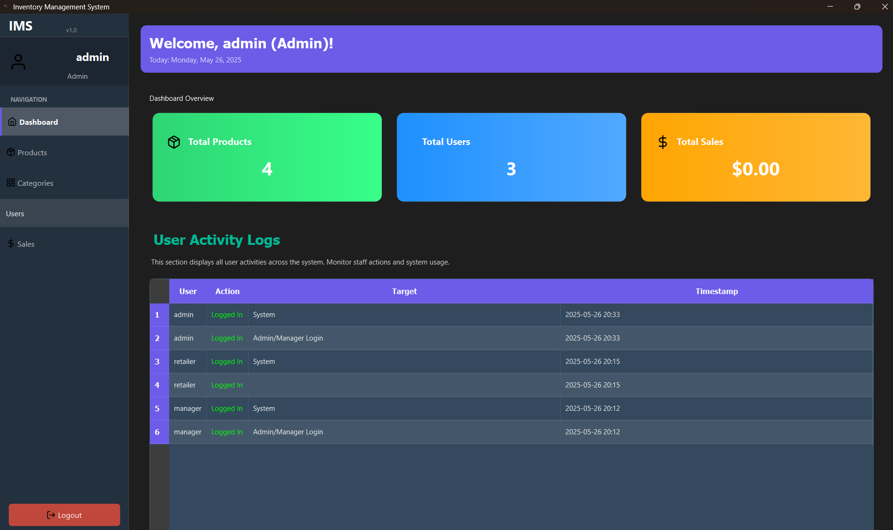
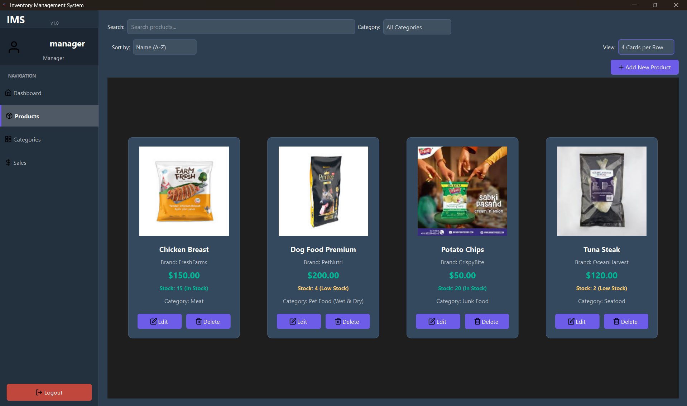
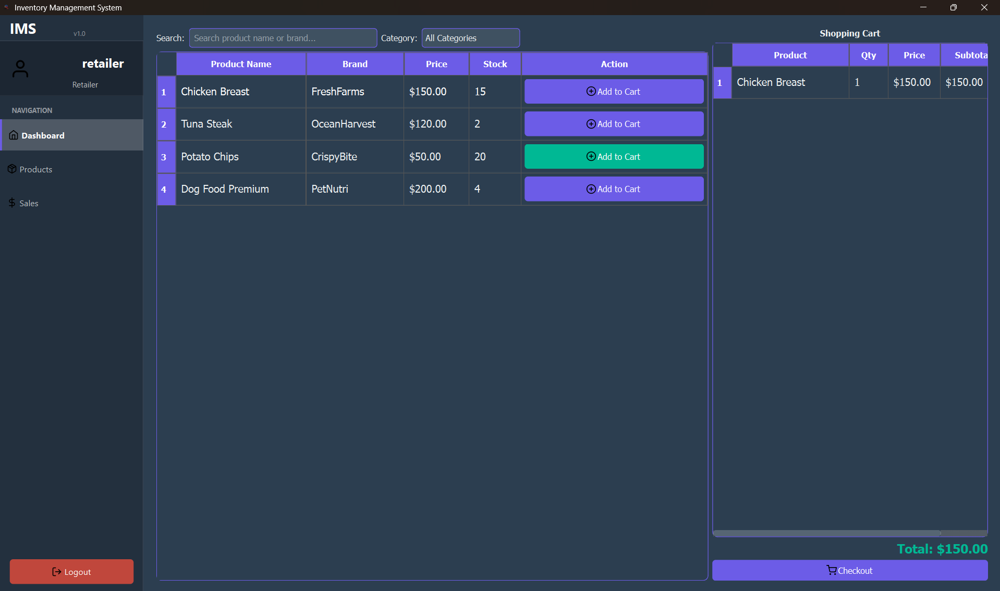

<div align="center">
  
  <h1>LogiJex - Python Inventory Management System</h1>
</div>

<p align="center">
  
  
  
  
</p>

## 📝 Overview

LogiJex is a robust desktop application built with Python and PyQt6, designed for comprehensive inventory management. It provides a user-friendly interface for tracking products, managing stock levels, processing sales, and monitoring user activities. The system features role-based access control, catering to different user responsibilities within an organization, from administrators to retailers.






## ✨ Key Features

*   **User Authentication & Management:** Secure login with password protection. Multi-Factor Authentication (MFA) via email for Admin and Manager roles. Admins can manage user accounts (CRUD operations).
*   **Product Management:** Add, edit, and delete products with details such as name, brand, category, price, stock quantity, image, expiration date, and minimum stock level.
*   **Category Management:** Organize products by creating, editing, and deleting categories.
*   **Inventory Tracking:**
    *   Real-time stock level updates.
    *   Low stock alerts for items below their minimum threshold.
    *   Notifications for items nearing their expiration date.
    *   Inventory history tracking (last restocked).
*   **Sales Processing:**
    *   Point-of-Sale (POS) interface for Retailers to add items to a cart and process checkouts.
    *   Automatic stock deduction upon sale.
    *   Ability to undo sales (for authorized roles).
*   **Reporting & Analytics:**
    *   Sales reports filterable by date range.
    *   Dashboard summaries for key metrics.
*   **User Activity Logging:** Comprehensive logging of user actions for auditing and monitoring purposes.
*   **Role-Based Access Control (RBAC):** Distinct dashboards and functionalities tailored for Admin, Manager, and Retailer roles, ensuring users only access features relevant to their responsibilities.
*   **Modern UI:** A clean and intuitive graphical user interface built with PyQt6, featuring themed components and icon-based navigation.

## 🧑‍💻 User Roles & Dashboards

The application offers three distinct user roles, each with a dedicated dashboard:

### ⚙️ 1. Admin Dashboard
   The Admin dashboard provides a high-level overview of the entire system and full control over its configuration.
   *   **Key Metrics:** Displays total products, total registered users, and total sales figures.
   *   **User Management:** Full CRUD capabilities for user accounts (add, edit, delete users, change roles, activate/deactivate accounts).
   *   **System Activity Logs:** A comprehensive view of all actions performed by users across the system, crucial for auditing and security monitoring.
   *   **Access to all other management sections:** Products, Categories, and Sales.

### 📊 2. Manager Dashboard
   The Manager dashboard focuses on operational oversight, inventory health, and product management.
   *   **Key Metrics:** Displays total products, total sales, number of low stock items, and items expiring soon.
   *   **Inventory Alerts:**
        *   **Low Stock Items Table:** Lists products currently below their minimum defined stock level.
        *   **Expiring Items Table:** Lists products approaching their expiration date (within the next 7 days by default).
   *   **Product Management Focus:**
        *   Grid view of products with options to add stock directly or edit product details.
        *   Advanced filtering (by search term, category, brand, stock status) and sorting for product lists.
   *   **Access to:** Product Management, Category Management, and Sales Management.

### 🛒 3. Retailer Dashboard
   The Retailer dashboard is streamlined for sales operations and product browsing.
   *   **Point-of-Sale (POS) Interface:**
        *   Product listing table with search and category filtering.
        *   Ability to add products to a shopping cart.
        *   Cart management (edit quantity, remove items).
        *   Process checkout, which records the sale and updates stock levels.
   *   **View-Only Access:** Retailers primarily interact with products for sales purposes and have limited access to administrative or extensive management features.

## 🛠️ Technical Requirements

### Software
*   **Python:** Version 3.7 or higher (Python 3.9+ recommended).
*   **MySQL Server:** A running MySQL server instance is required for the database.

### Python Libraries
The application relies on the following Python libraries. These can typically be installed via pip:

```bash
pip install PyQt6 mysql-connector-python python-dotenv
```

| Library                 | Purpose                                                                  |
|-------------------------|--------------------------------------------------------------------------|
| PyQt6                   | For the graphical user interface.                                        |
| PyQt6-QtSvg (optional)  | May be needed for advanced SVG rendering (not essential for current setup).|
| mysql-connector-python  | For interacting with the MySQL database.                                 |
| python-dotenv           | For managing environment variables (e.g., database credentials).         |
| Standard Libraries      | `hashlib`, `datetime`, `os`, `json`, etc. (Built into Python)            |

## 🚀 Setup and Installation

1.  **Clone the Repository (if applicable):**
    ```bash
    git clone https://github.com/stultumJay/LogiJex-Python-App.git
    cd LogiJex-Python-App
    ```

2.  **Install Dependencies:**
    Open your terminal or command prompt and run:
    ```bash
    pip install -r requirements.txt
    ```
    *(Note: You may need to create a `requirements.txt` file if one isn't provided. Based on the analysis, it would contain `PyQt6`, `mysql-connector-python`, and `python-dotenv`)*

3.  **Setup MySQL Database:**
    *   Ensure your MySQL server is running.
    *   The application includes a utility script to set up the database schema and default data:
        ```bash
        python utils/setup_mysql.py
        ```
    *   This script will attempt to create the database (default: `inventory_db`) and the necessary tables.

4.  **Configure Environment Variables:**
    *   Create a `.env` file in the root directory of the project.
    *   Add your MySQL database connection details to this file. Example:
        ```env
        DB_HOST=localhost
        DB_USER=your_mysql_user
        DB_PASSWORD=your_mysql_password
        DB_NAME=inventory_db
        
        # Optional: For MFA email sending (if using real email service)
        # MFA_SENDER_EMAIL=your_email_address
        # MFA_SENDER_PASSWORD=your_email_password
        ```
    *   The `DatabaseManager` and `setup_mysql.py` will use these values, with defaults if not provided.

## ▶️ How to Run

Once the setup is complete, you can run the application using:

```bash
python main.py
```
*(Assuming `main.py` is the entry point of your application, which typically instantiates and shows `LoginWindow` or `MainWindow`)*

## 📂 Directory Structure

A brief overview of the project's directory structure:

*   `assets/`: Contains static files.
    *   `icons/`: SVG and PNG icons used in the UI.
    *   `images/`: General images like the application logo.
    *   `product_images/`: Directory where uploaded product images are stored.
*   `core/`: Contains the core business logic and manager classes.
    *   `activity_logger.py`: Handles logging of user activities.
    *   `database_manager.py`: Manages all database interactions.
    *   `inventory_manager.py`: Provides inventory-specific queries (low stock, expiring items).
    *   `mfa_service.py`: Handles Multi-Factor Authentication logic.
    *   `product_manager.py`: Manages CRUD operations for products and categories.
    *   `sales_manager.py`: Manages sales recording and reporting.
    *   `user_manager.py`: Manages user authentication and CRUD operations.
*   `ui/`: Contains the PyQt6 user interface components (windows, dialogs, widgets).
    *   `dashboard_widgets.py`: Defines the widgets for Admin, Manager, and Retailer dashboards.
    *   `category_management.py`: UI for managing product categories.
    *   `login_window.py`: The application's login dialog.
    *   `main_window.py`: The main application window after login, containing the sidebar and content area.
    *   `mfa_window.py`: Dialog for MFA code entry.
    *   `product_management.py`: UI for managing products.
    *   `sales_management.py`: UI for sales reporting and possibly recording.
    *   `user_management.py`: UI for managing users.
*   `utils/`: Contains utility scripts, helper functions, and configuration.
    *   `config.py`: Centralized application configuration (colors, fonts, paths).
    *   `decorators.py`: Custom decorators (e.g., `role_required`).
    *   `hash_test.py`: Utility for testing password hashing.
    *   `helpers.py`: General helper functions (icon loading, image handling).
    *   `icon_utils.py`: Utilities specifically for SVG icon manipulation.
    *   `image_utils.py`: Utilities for product image handling.
    *   `setup_mysql.py`: Standalone script to set up the MySQL database.
    *   `styles.py`: Stylesheet definitions for UI components.
*   `main.py`: The main entry point of the application.
*   `README.md`: This file, providing information about the project.

---
<p align="center"> Copyright &copy; 2025 Gerfel Jay Jimenez </p>
